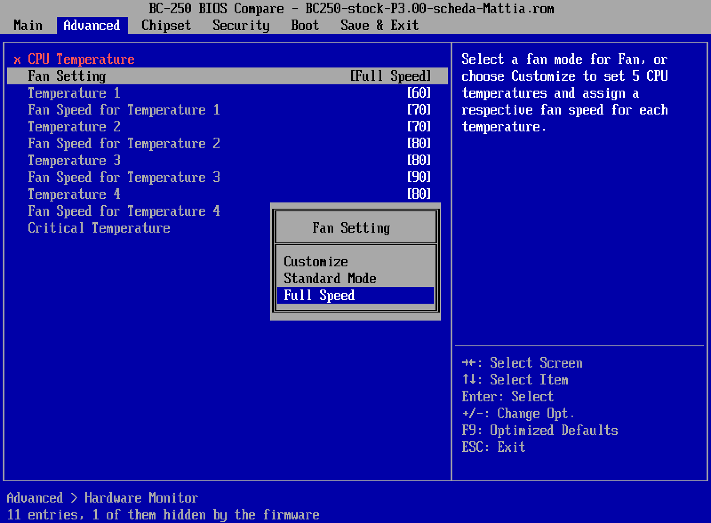

# BC-250 BIOS Compare

Reads BIOS images of the AMD BC-250, shows their menus and compares them: **all** the entries,
including the 651 the firmware hides, which a running board cannot show you by
definition. Then it evaluates the firmware's own conditions against a state of
the variables and tells you what changes when you change an entry.

Runs on Windows and Linux with Python 3 alone (tested on 3.11). Nothing to
install, no external binary: `lzma` is in the standard library and everything
else is ours.

## What it is, and what it is not

**It does not boot the BIOS.** An emulator that boots it is not realistic:
before the menu come AMD's PSP and AGESA, initialising undocumented silicon.
That hardware does not exist in QEMU.

But the menu is not code that draws windows: it is a data structure (**IFR**)
that a standard engine interprets. We rewrote that engine. The result beats
booting, because it also shows what the firmware would hide.

## The window

    python Bc250BiosCompare.pyw            # or: python window.py dump.rom

On Windows a double click is enough. On Debian and its derivatives - SkillFishOS
included - the one thing to install is tkinter, which is not in the standard
Debian Python:

```bash
sudo apt install python3-tk
```

That is the whole of it. Everything else the program needs is in the standard
library, so the sources run as they are on both systems.

### Installing it, if you would rather not run it from the sources

    python3 build.py               # builds dist/bc250-bios-compare
    python3 build.py --install     # and puts it in ~/.local, with a menu entry

`--install` copies three files - the binary into `~/.local/bin`, the icon into
`~/.local/share/icons`, the `.desktop` entry into `~/.local/share/applications`.
No root, nothing of the system touched, and `--uninstall` removes exactly those
three. On Windows the same script builds `Bc250BiosCompare.exe`, and with
`--setup` the installer as well.


That picture was drawn by the program running on a BC-250 board itself, under
SkillFishOS with Python 3.14: same glyphs out of the image, same EFI palette,
same tab bar read out of AMITSE. Nothing in the drawing is platform-dependent,
which is the point of drawing it ourselves.

**A one-file build is tied to the glibc of the machine that made it**: it runs
on that version and on newer ones, never on older. Built on SkillFishOS
(glibc 2.43) it will not start on Debian 12 or Ubuntu 22.04 - so a binary meant
to be handed around wants building on the oldest system worth supporting. The
sources have no such problem.

The tree of menus is on the left, the selected entry and the effect of your
changes on the right. It starts **in English**: this is a tool for a community
that speaks English. The drop-down at the top right offers the **nine
SkillFishOS languages** (en, it, es, pt, fr, de, pl, uk, ru) and remembers the
choice.

### Every subform, including the walled-up ones

**The subform hierarchy is not in how the data is nested.** Inside a form set
all forms are siblings: what links them are the `Ref` entries. Look only at the
nesting and you see seventy-one forms in a row and no hierarchy at all.

The tree follows the `Ref`s, so it shows the real structure. At the bottom,
marked *not linked from any menu*, sit the forms no link leads to: in AMD CBS
there are 66 of them out of 71, and they are the part a running board cannot
reach by any route.

### The explanation window

Double-click an entry, or press **Explain in detail…**: a window opens, stays
open and follows the selection. It keeps two sources apart, and that is the
point:

- **what the firmware says** - where the value is stored (variable, GUID,
  offset, byte in the file), the options, the defaults, the conditions with
  their outcome, ready-made commands to read and write it on a running board,
  and **which other entries change state** for every possible value of this
  one. Not opinion: computed from the image.
- **what we know** - the hand-written cards in `cards/<language>.json`: what
  the parameter is for, what it does *on the BC-250*, what happened when we put
  our hands on it.

Where a card does not exist yet **the program says so** instead of filling the
gap with a generic sentence. An invented explanation of a firmware parameter is
not a service: it is a way of making someone else spend an afternoon working
out why their board no longer boots.

There are **28 cards matched by exact name and 21 matched by family** - the
eight `GRA Group` entries, the sixty GDDR6 mode registers from `MR0` to `MR8`,
the `UMCCONFIG` masks, the clock gating switches - which together cover
**48% of the 1507 entries** of a stock image, in all nine languages. A family
card is written once and corrected in one place.

### Walking the menu the way the board shows it


The **BIOS view** tab draws the same menu the board would: tab bar across the
top, entries with their value in brackets, help panel on the right, key legend
at the bottom. It is driven by the same keys - arrows to move, Enter to walk
into a submenu, Esc to come back, `+`/`-` to change a value, F9 for defaults.

Nothing on that screen is an approximation:

- **the font is the one inside the image** - the BIOS carries its glyphs as an
  HII Simple Font package, 8 by 19 pixels each, and `hiifont.py` pulls them
  out; the stock BC-250 image has 242 of them, frame pieces and arrows
  included;
- **the colours are the sixteen EFI console colours**, the palette the firmware
  itself is limited to - EFI blue is `#0000A8`, not "a blue that looks about
  right";
- **the grid is 100 by 31 characters**, the text mode the setup runs in.

The picture above was not screen-captured: `BiosView.export_png()` builds it
from the same glyphs and the same palette the window draws with, so it is exact
and repeatable.

Every kind of entry is editable, the way the setup edits it: Enter on a choice
opens the option list, Enter on a number opens a box you type into, digits go
straight in, plus and minus step through values, and a checkbox flips. Date and
time are edited in place - left and right, or Tab, move between month, day and
year, and the part under the cursor is shown in reverse. The board keeps those
two in the RTC and not in a variable, so this screen keeps a clock of its own.



Text entries are typed into the same way, and written back as the UCS-2 the
firmware stores. Password entries open the box and mask what you type, but
nothing is written: the firmware keeps a hash of the password, not the
password, and we cannot compute it. The box says so before you type, not
after.

Two things happen here that cannot happen on a real board:

- the hidden entries can be **revealed in place**, marked rather than missing,
  so you see where in the menu the 651 of them actually live;
- changing a value re-evaluates every condition at once, so entries appear and
  disappear under your hands, with no reboot in between.

Cross links are followed too: pressing Enter on `Chipset > GFX Configuration`
lands inside the AMD CBS form set, exactly as it does on the board.

The vendor's title and copyright lines are deliberately **not** reproduced. The
layout is the point; printing somebody else's banner at the top of our own
window would be claiming to be their firmware. The footer shows the firmware
version read from the image instead.

### The rest of it

- The **state** column says whether an entry is shown, **hidden**, shown but
  **not changeable**, or whether its condition **cannot be computed**.
- Change a value, press **Apply**, and the entries that change state are
  coloured in the tree and listed underneath: that is the answer to "if I set
  this to Enabled, what appears and what disappears?".
- **Values**: the firmware defaults, or the real variable read off a running
  board.
- **Compare with…** opens the differences between the menus of two images.

## The command line

    python emulator.py volumes  IMAGE
    python emulator.py formsets IMAGE
    python emulator.py tree     IMAGE [--formset N] [--all] [--variable FILE]
    python emulator.py entry    IMAGE TEXT [--variable FILE]
    python emulator.py simulate IMAGE "ENTRY=VALUE" ["ENTRY=VALUE" ...]
    python emulator.py compare  IMAGE-A IMAGE-B
    python emulator.py export   IMAGE FILE.json

Real examples, on a board dump:

    # where an entry lives inside the UEFI variable
    python emulator.py entry dump.rom "UMA Frame buffer Size"

    # the menu as it is RIGHT NOW on a running board, not as it ships
    python emulator.py tree dump.rom --variable AmdSetup.bin

    # what happens when an entry is set to another value
    python emulator.py simulate dump.rom "GRA Group 1=Enabled"

    # what a modified BIOS really adds: the menus are diffed, not the bytes
    python emulator.py compare stock.rom meimei-v3.rom

### Reading the variable off the board

`AmdSetup` is visible from Linux on a running board. **`scp` will not copy it**
(efivarfs does not allow that): it has to go through base64.

```bash
ssh root@board "base64 -w0 /sys/firmware/efi/efivars/AmdSetup-3a997502-647a-4c82-998e-52ef9486a247" | base64 -d > AmdSetup.bin
```

The first 4 bytes of the file are the **attributes** and are not part of the
variable: the emulator drops them by itself after checking that the length adds
up (2233 = 4 + 0x8B5).

## How it is put together

| module | what it does |
|--------|--------------|
| `volumes.py` | finds the UEFI volumes in the raw image by the `_FVH` signature, validating the header checksum |
| `ffs.py` | opens FFS files, sections, LZMA decompression and nested volumes |
| `hii.py` | finds the HII packages (strings and forms) and joins them into a model: form sets, variables, entries, options, defaults, and the real subform hierarchy |
| `ifr.py` | the IFR opcodes read as a tree of objects - our own parser |
| `engine.py` | evaluates `SuppressIf` / `GrayOutIf` / `DisableIf` against a state of the variables |
| `explain.py` | the explanation of one entry: what the firmware says, plus the cards in `cards/<code>.json` |
| `emulator.py` | the command line |
| `window.py` | the interface (tkinter), with `theme.py` |
| `languages.py` | the nine languages; the strings live in `languages/<code>.json` |
| `tse.py` | reads the tab bar out of AMITSE, where the setup engine really keeps it |
| `build.py`, `icon.py` | build the executable - `Bc250BiosCompare.exe` on Windows, `bc250-bios-compare` plus its `.desktop` entry on Linux |

A forge - putting a modified image back together - is still missing. It is step
four, and it comes last, after writing the variable has been proven on real
hardware.

## What has been verified, and how

On the real dump of Mattia's board (`md5 3487f648a69a781d2609a8d4e6f4808e`) and
on the development board's, on 30/08/2026:

- **1134 settable entries** and **651 behind a SuppressIf** in the `AMD CBS`
  form set: the very same numbers IFRExtractor-RS v1.6.1 gives. (The emulator
  counts 1193 because it also includes the 59 `Ref` entries, which are links to
  other forms, not entries with a value.)
- **VarStore `AmdSetup`**, GUID `3A997502-647A-4C82-998E-52EF9486A247`, size
  `0x8B5` - matching, to the byte, the variable read from Linux.
- **The offsets**: CPB `0x004`, Downcore `0x007`, UMA `0x25F` (4 bytes), IOMMU
  `0x264`, IOMMU Page Table Format `0x265`, MemClock `0x316`.
- **The values read from the real variable** of the development board: CPB=1,
  Downcore=0, UMA=0xFFFFFFFF, IOMMU=0xF, MemClock=0xFF - the same values read
  by hand on the running board.
- Comparing the dumps of **two different boards** with the same firmware gives
  identical menus, as it must.

What is **not** verified: that writing the variable has any effect. Many AMI
firmwares read the Setup variables only at boot, and some validate or rewrite
them. That gets tried on the development board, with the backup and the
external programmer ready.

## Traps that cost us time

- In the HII string package header the language tag is at offset **46**, not
  44: the two bytes of `LanguageName` sit in between. Validating at 44 finds no
  package at all and makes it look as if the firmware had no strings - while it
  has 151 KB of them.
- The HII packages are not in a section of their own: they are **inside the
  driver's PE32 section**. Looking only in raw sections finds nothing.
- FFS files of type *raw* have no sections: if you only walk the sections,
  their content is never examined.
- The compression is **LZMA "alone"** (5 property bytes + 8 of length): with
  `lzma.FORMAT_AUTO` Python says the data is invalid and a good image looks
  corrupt.
- IFR expressions are in **reverse polish notation** and are **not delimited**:
  they end at the first opcode that is not an expression opcode.
- Menu strings are **UTF-16**: grepping for them in ASCII finds nothing.
- A constant condition is not always the `True` opcode: the VFR compiler also
  writes `Uint64(1)`. `Above 4G Decoding` is walled up exactly that way.

## Translating

Keys are the English strings, one file per language - the SkillFishOS
convention, for the SkillFishOS reason: whoever wants to help sends **one
file**, not a change inside Python sources they have never seen.

- interface: `languages/<code>.json`
- parameter cards: `cards/<code>.json` (start by copying `en.json`)

If a file is missing or broken, English is used and nothing is said: a missing
translation is an annoyance, a program that does not start is a fault.

## The material directory

`material/` holds the dumps and variables pulled off the boards. **They are not
published**: they are the state of real machines - boot entries, disk serial
numbers, the memory configuration of that particular board.

## Licence

GPL-3.0-or-later, the same licence as [SkillFishOS](https://github.com/MTSistemi/SkillFishOS).
See `LICENSE`.

Written by MTSistemi for the BC-250 community. The firmware
images themselves belong to their vendors and are not distributed here.
